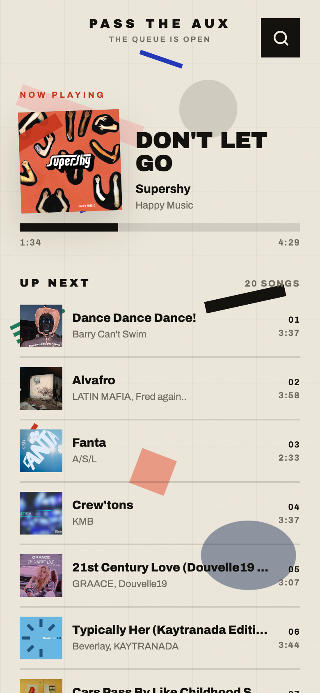

# Pass the Aux

Spotify party queue for house parties. Guests scan a QR, search, and queue songs
to the host's Spotify. They cannot skip, pause, or take over playback, and every
pick passes a vibe check. Guests need no Spotify account, no AirPlay access, no
WiFi - just the QR.

**Live → [aux.tejas.nyc](https://aux.tejas.nyc/)**

<p align="center"></p>

[](https://deploy.workers.cloudflare.com/?url=https://github.com/tejasdc/pass-the-aux)

## Why

Spotify's own sharing options - Jam, shared speakers, handing your phone around -
all give guests full playback control. One mistap hits play instead of queue,
skips the song mid-chorus, or swaps in someone else's playlist. Pass the Aux is
the controlled gateway: guests can search and queue, nothing else.

The live client uses a warm suprematist skin after Kazimir Malevich's
*Suprematist Painting* (1916-17). Floating geometric shapes drift, collide,
ripple on taps, and can be dragged while guests wait to queue a track.

## How it works

- **Party sessions** - the public app is closed until the host starts a live
  party. Live sessions last 8 hours and can be ended explicitly by the host.
- **Host-only auth** - the party host opens `/host` and authenticates with
  Spotify Premium. The first Spotify user to complete host OAuth is bound as the
  host in KV; after that, any other Spotify identity is refused. Guests never
  log in, and Spotify development mode limits OAuth to the owner and explicitly
  allowlisted users.
- **Now Playing + Up Next** - everyone sees the current track and upcoming
  queue.
- **Search & queue** - guests search Spotify and add songs with one tap.
- **Rate limiting** - guests are limited to 10 queued songs per hour.
- **Vibe matching** - queued songs are checked against the party's energy via
  ReccoBeats audio features; off-vibe picks get a friendly rejection.

Print the QR, tape it to the wall, start the party from `/host`, done.

## Stack

- `client/` - Vite + React, built as static assets
- `worker/` - Cloudflare Worker API that proxies Spotify with the host's token
- Cloudflare Workers Assets - serves the built client from the same Worker
- Cloudflare KV - persists host Spotify tokens, party sessions, OAuth state,
  rate-limit windows, and party vibe state
- `server/` + `render.yaml` - legacy Render deployment kept live until cutover

## Run it locally

```bash
npm install
npm run build
npx wrangler dev
```

Set local Worker secrets in `.dev.vars` when testing real Spotify auth:

```bash
SPOTIFY_CLIENT_ID=...
SPOTIFY_CLIENT_SECRET=...
SPOTIFY_REDIRECT_URI=http://localhost:8787/api/auth/callback
```

Then open `/host` and continue through Spotify OAuth. Guests continue to use the
same-origin app and relative `/api/*` routes. When no party is live, guests see a
closed-party state and the Worker refuses Spotify-backed search and queue
requests server-side.

## Deploy your own

1. Fork this repo.
2. Create a free Spotify developer app at
   [developer.spotify.com/dashboard](https://developer.spotify.com/dashboard).
3. Register your callback URL in the Spotify app settings. For local testing,
   use `http://localhost:8787/api/auth/callback`; for production, use your
   deployed Worker origin plus `/api/auth/callback`.
4. Set the three Worker secrets:

```bash
npx wrangler secret put SPOTIFY_CLIENT_ID
npx wrangler secret put SPOTIFY_CLIENT_SECRET
npx wrangler secret put SPOTIFY_REDIRECT_URI
```

5. Deploy:

```bash
npm install
npx wrangler deploy
```

`wrangler deploy` runs the client build, uploads `client/dist` as Workers Assets,
deploys the Worker API, and auto-provisions the `PARTY_QUEUE_KV` namespace
declared in `wrangler.jsonc` if it does not already exist.

You can also start from the Cloudflare one-click flow:
[Deploy to Cloudflare](https://deploy.workers.cloudflare.com/?url=https://github.com/tejasdc/pass-the-aux).

## Party flow

1. The host visits `/host` and starts Spotify OAuth.
2. After Spotify returns successfully, the Worker fetches the Spotify user
   profile. If no host is bound yet, that Spotify user id is saved in KV as the
   host.
3. The Worker stores the bound host's token, issues a host session cookie, and
   opens a single live party session in KV with an 8-hour expiry.
4. Future host OAuth attempts must come from the same Spotify user id. Other
   Spotify identities are refused before tokens are saved or a party is started.
5. Guests can search and add tracks only while that session is live. If the host
   ends the party, or the KV session expires, search and queue endpoints return
   `403` and the app shows "No party right now."

## Letting a friend host

Spotify development mode only allows users listed in the app's User Management
screen to complete OAuth. To let a friend host:

1. Open the Spotify dashboard for the app.
2. Go to **User Management** and add their name and email. Spotify development
   mode allows up to 5 accounts.
3. Reset the current host binding in production KV:

```bash
npx wrangler kv key delete --binding PARTY_QUEUE_KV "host:spotify-user-id" --remote
```

The next allowlisted Spotify account to complete `/host` OAuth becomes the bound
host. Strangers still cannot host because Spotify refuses OAuth for accounts not
listed in User Management.

## Change the bound host

If the host Spotify account ever needs to change, delete the binding from the
production KV namespace, then have the new host start OAuth from `/host`:

```bash
npx wrangler kv key delete --binding PARTY_QUEUE_KV "host:spotify-user-id" --remote
```

## Provenance

Design after Kazimir Malevich,
[*Suprematist Painting* (1916-17)](https://www.moma.org/collection/works/80387).

Built with an AI agent in a [Cortex](https://cortex.ideaflow.app) cloud
workspace, February 2026, for an actual house party.
