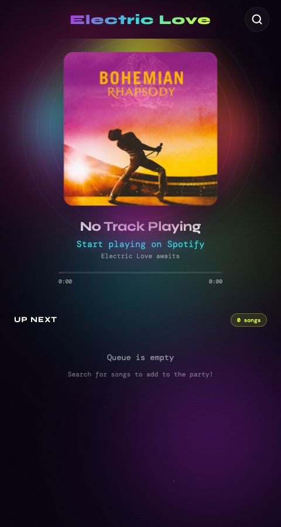

# Electric Love

Ever shared your Spotify at a house party and watched someone play a song instead of queuing it? Playlist gone, vibe dead.

Electric Love is the fix: guests scan a QR code, search the catalog, and add songs to the queue — without ever touching the host's Spotify. Nobody can skip, pause, or take over playback, and every pick has to pass the vibe check.

**Live -> [electric-love-party-queue.thnkring.workers.dev](https://electric-love-party-queue.thnkring.workers.dev/)**

<p align="center">
  
</p>

## Why

Spotify's own sharing options — Jam, shared speakers, handing your phone around — all give guests full playback control. One mistap hits play instead of queue, skips the song mid-chorus, or swaps in someone else's playlist. Electric Love is the controlled gateway — guests can search and queue, nothing else.

## How it works

- **Party sessions** — the public app is closed until the host starts a live party. Live sessions last 8 hours and can be ended explicitly by the host.
- **Host-only auth** — the party host opens `/host`, enters the host passphrase, then authenticates with Spotify Premium; the server holds and refreshes that one token. Guests never log in — zero friction, and it sidesteps Spotify's dev-mode user limit.
- **Now Playing + Up Next** — everyone sees the current track and the upcoming queue.
- **Search & queue** — full Spotify catalog search, one tap to add.
- **Rate limiting** — 10 songs per hour per guest, so nobody floods the queue.
- **Vibe matching** — queued songs are checked against the party's energy (via ReccoBeats audio features, after Spotify deprecated their Audio Features API); off-vibe picks get a friendly rejection.

Print the QR (`electric-love-qr.png`), tape it to the wall, start the party from `/host`, done.

## Stack

- `client/` — Vite + React, built as static assets
- `worker/` — Cloudflare Worker API that proxies Spotify with the host's token
- Cloudflare Workers Assets — serves the built client from the same Worker
- Cloudflare KV — persists host Spotify tokens, party sessions, OAuth state, rate-limit windows, and party vibe state
- `server/` + `render.yaml` — legacy Render deployment kept live until cutover

## Run it locally

```bash
npm install
npm run build
npx wrangler dev
```

Set local Worker secrets in `.dev.vars` when testing real Spotify auth:

```bash
SPOTIFY_CLIENT_ID=...
SPOTIFY_CLIENT_SECRET=...
SPOTIFY_REDIRECT_URI=http://localhost:8787/api/auth/callback
HOST_KEY=...
```

Then open `/host`, enter the host passphrase, and continue through Spotify OAuth. Guests continue to use the same origin app and relative `/api/*` routes. When no party is live, guests see a closed-party state and the Worker refuses Spotify-backed search and queue requests server-side.

## Deploy

Cloudflare Workers is the primary deployment target. From the repo root:

```bash
npm install
npx wrangler secret put SPOTIFY_CLIENT_ID
npx wrangler secret put SPOTIFY_CLIENT_SECRET
npx wrangler secret put HOST_KEY
npx wrangler deploy
```

`wrangler deploy` runs the client build, uploads `client/dist` as Workers Assets, deploys the Worker API, and auto-provisions the `PARTY_QUEUE_KV` namespace declared in `wrangler.jsonc` if it does not already exist.

Configure the Spotify app redirect URI to the deployed Worker origin plus `/api/auth/callback`, or set the `SPOTIFY_REDIRECT_URI` Worker secret/variable to the exact callback URL. The Render blueprint remains in `render.yaml` as the legacy deployment until traffic is cut over.

## Party flow

1. The host visits `/host` and enters the passphrase stored in the `HOST_KEY` Worker secret.
2. The Worker verifies the passphrase, creates a short-lived OAuth grant, and redirects the host through Spotify OAuth.
3. After Spotify returns successfully, the Worker stores the host token and opens a single live party session in KV with an 8-hour expiry.
4. Guests can search and add tracks only while that session is live. If the host ends the party, or the KV session expires, search and queue endpoints return `403` and the app shows "No party right now."

## Provenance

Built with an AI agent in a [Cortex](https://cortex.ideaflow.app) cloud workspace, February 2026, for an actual house party.
